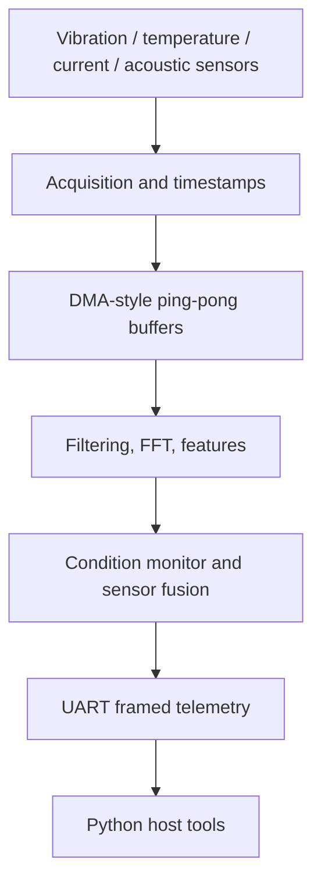

# Architecture

The application sits above a replaceable board-support interface. The current executable uses deterministic simulated sensor sources; on target, the same acquisition events would be produced by STM32 HAL ADC/I2C/SPI and DMA callbacks.

The host build exercises DSP, threshold logic, and protocol code without FreeRTOS or STM32Cube dependencies. The intended target tasks are acquisition, processing, health monitoring, communication, and logging. A task notification signals completed DMA buffers; a bounded queue transfers buffer descriptors, and a mutex is reserved for shared log output.
