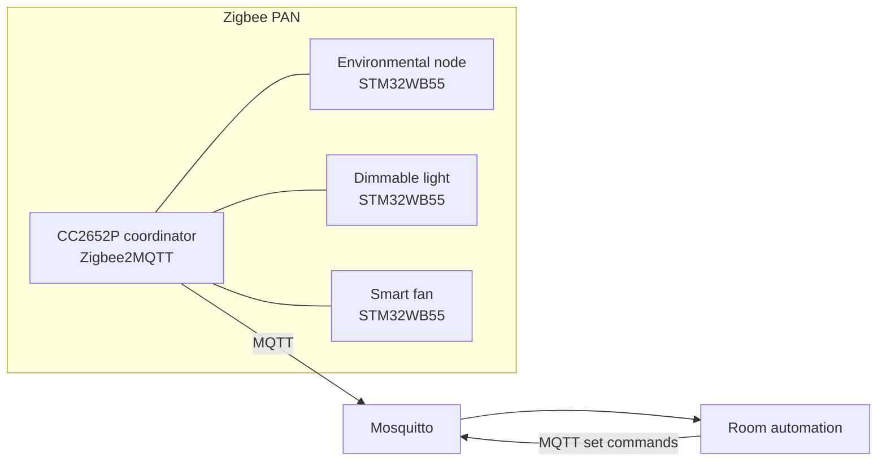
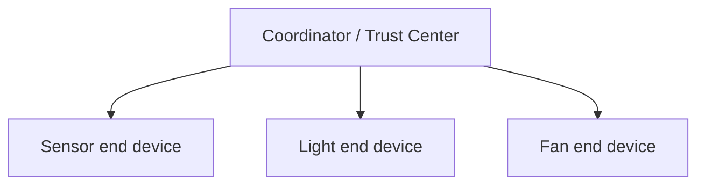
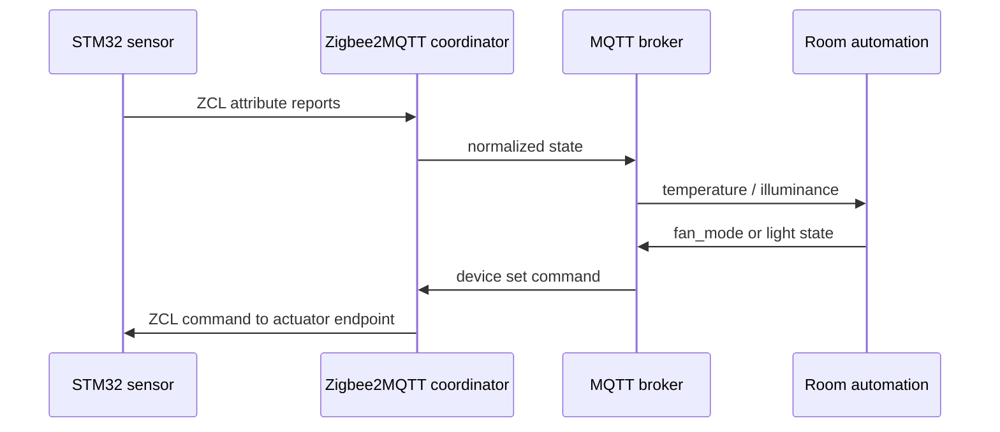

# Zigbee Smart Room

A Zigbee room monitoring and control project with three STM32WB55 end devices and a CC2652P coordinator. Sensor readings use standard ZCL measurement clusters. A host service applies temperature and illuminance hysteresis and sends standard light/fan controls through Zigbee2MQTT.

## Overview

The environmental node samples an SHT31-DIS and VEML6030. The light node exposes On/Off and Level Control. The fan node exposes On/Off and Fan Control with discrete off/low/medium/high speeds mapped to PWM. The coordinator and MQTT bridge run on the host using a Sonoff ZBDongle-P (TI CC2652P).

## Features

- Embedded C99 application logic and STM32 HAL sensor/actuator drivers
- ST STM32CubeWB Zigbee 3.0 stack on NUCLEO-WB55RG
- Standard ZCL endpoints, clusters, attributes, commands, and reporting defaults
- Zigbee2MQTT coordinator deployment and MQTT room automation
- Testable host policy logic and hardware BOM/wiring documentation

## System Architecture



The CC2652P adapter is the sole coordinator. The mains-powered STM32 devices join as non-sleepy end devices and do not route traffic. Zigbee2MQTT handles coordinator duties and MQTT state/command translation; the Python service owns room policy.

## Hardware

Three ST NUCLEO-WB55RG boards; one Sonoff ZBDongle-P (CC2652P); one SHT31-DIS breakout; one VEML6030 breakout; one LED and 220 ohm resistor; one 5 V brushless DC fan; AO3400A logic N-MOSFET, 100 ohm gate resistor, 100 kOhm pulldown; regulated 5 V fan supply; and I2C pull-ups if not present on the breakouts. See [hardware/BOM.csv](hardware/BOM.csv) and [docs/hardware.md](docs/hardware.md).

## Software Architecture

`firmware/common` contains portable measurement conversion, actuator state, and ZCL illuminance encoding. `firmware/drivers` contains STM32 HAL I2C drivers. `firmware/zigbee` builds device endpoints and cluster servers using CubeWB APIs. `firmware/platform` maps board I/O. `host/coordinator` contains the MQTT automation process. CubeWB supplies the Zigbee PRO stack, dual-core transport, security, routing, addressing, and ZCL cluster templates.

## Zigbee Architecture

The CC2652P is the coordinator and trust center. Three STM32WB nodes join the same PAN. Each application uses endpoint 1 with Home Automation profile 0x0104. End devices have routing disabled, while `RxOnWhenIdle` remains enabled to keep the mains-powered light and fan responsive. See [docs/zigbee.md](docs/zigbee.md) and [docs/commissioning.md](docs/commissioning.md).

## ZCL Clusters

| Device | Endpoint | Cluster | ID | Purpose |
|---|---:|---|---:|---|
| Environmental node | 1 | Basic | 0x0000 | Identity |
| Environmental node | 1 | Identify | 0x0003 | Identify behavior |
| Environmental node | 1 | Illuminance Measurement | 0x0400 | Ambient light |
| Environmental node | 1 | Temperature Measurement | 0x0402 | Temperature |
| Environmental node | 1 | Relative Humidity Measurement | 0x0405 | Humidity |
| Light | 1 | On/Off | 0x0006 | Switching |
| Light | 1 | Level Control | 0x0008 | Dimming |
| Fan | 1 | On/Off | 0x0006 | Switching |
| Fan | 1 | Fan Control | 0x0202 | Discrete speed modes |

## Network Topology



There are no Zigbee routers in this room-scale demo. The coordinator maintains addresses, security, and network membership; the stack handles routing if the network is extended with routers.

## Communication Flow



## Automatic Control

Fan mode changes to low at 28 C, medium at 29 C, and high at 32 C; it returns to off at or below 26 C. Light turns on below 100 lx and off above 140 lx. Thresholds are in `host/coordinator/config.json`. They are demonstration values, not safety limits.

## Build Instructions

### Coordinator and host

On a Linux host with Docker Compose, set the exact coordinator device path in `.env`, then run:

```sh
cp .env.example .env
# Edit ZIGBEE_SERIAL_PORT to the actual /dev/serial/by-id/... path
docker compose up -d
```

Open [http://localhost:8080](http://localhost:8080), permit joining, join each node, and assign friendly names `room_sensor`, `smart_light`, and `smart_fan`. Compose starts the Python automation controller with the broker; its logs are available with `docker compose logs -f room-controller`.

For running only the automation process outside Compose, install it with `pip install -e .` and run `zigbee-room --config host/coordinator/config.json`.

### STM32 devices

Target: NUCLEO-WB55RG, STM32CubeWB 1.20.0, STM32CubeIDE, STM32CubeProgrammer, ST-LINK, and ST's matching Zigbee FFD wireless coprocessor firmware. Import the CubeWB Zigbee Skeleton, then use `scripts/install_cubewb_sources.ps1` as detailed in [firmware/BUILD.md](firmware/BUILD.md). Build three images by setting `ROOM_DEVICE_ROLE` to `1` (sensor), `2` (light), or `3` (fan). The CPU2 wireless stack is separate from the application image and must be installed with CubeProgrammer/FUS.

## Flashing Instructions

Flash the application image over ST-LINK with STM32CubeProgrammer or CubeIDE. Install the release-matched signed Zigbee FFD binary on CPU2 first. Use separate application images for the three roles. See [docs/build.md](docs/build.md).

## Running the Dashboard

Zigbee2MQTT frontend at `http://localhost:8080` shows joined devices and supports manual control. The Python service subscribes to sensor state over MQTT and publishes actuator commands. The MQTT broker is bound to localhost by the Compose file.

## Testing

Run `python -m unittest discover -s tests -v` for host-side automation policy tests. Physical tests include I2C sensor readings, ZCL reports, coordinator joining/rejoining, light dimming, and fan speed changes. Those require the listed hardware.

## Hardware Setup

Connect SHT31-DIS and VEML6030 in parallel to I2C1 PB8/PB9. Connect the LED through its resistor to the board indicator output. PB0/TIM3_CH3 drives the light PWM output and PB1/TIM3_CH4 drives the fan MOSFET gate. Use a common ground and separate 5 V fan supply; never power the fan from an MCU pin. Full wiring is in [docs/hardware.md](docs/hardware.md).

## Repository Structure

```text
firmware/common/       Portable C logic and ZCL conversions
firmware/drivers/      SHT31 and VEML6030 HAL drivers
firmware/environmental_node/ Sensor sampling application
firmware/zigbee/       CubeWB endpoint/cluster registration and network join
firmware/platform/     Nucleo pin/peripheral configuration
host/coordinator/      MQTT control policy and service
host/zigbee2mqtt/      Zigbee2MQTT coordinator configuration
host/mosquitto/        MQTT broker configuration
hardware/              BOM and wiring
docs/                  Architecture, ZCL, commissioning, build, tests
scripts/               Local test helper
tests/                 Host unit tests
```

## Demonstration

1. Start Mosquitto and Zigbee2MQTT, then permit joining in its frontend.
2. Power up the environmental, light, and fan nodes and assign their friendly names.
3. Confirm temperature, humidity, and illuminance values in the frontend.
4. Cross the configured illuminance and temperature thresholds to observe automation.
5. Use the frontend to send On/Off, brightness, and fan mode commands.
