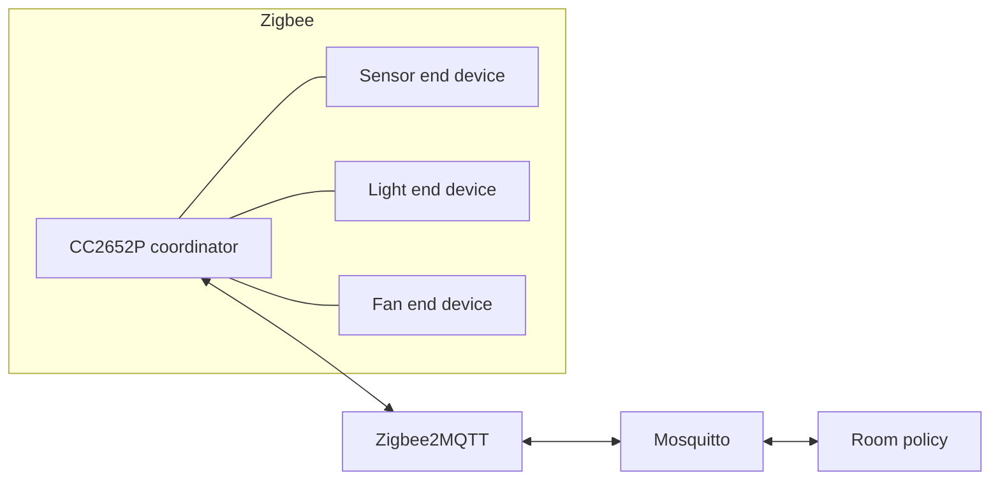

# Architecture

The CC2652P USB adapter running Zigbee2MQTT is the sole coordinator and trust center. Three NUCLEO-WB55RG boards join as mains-powered, non-sleepy end devices. The sensor endpoint reports measurements; light and fan endpoints accept standard clusters. Zigbee2MQTT bridges reports and commands through Mosquitto to the Python automation service.

Each device uses endpoint 1 and Home Automation profile 0x0104. CubeWB application code connects HAL sensor/actuator operations to vendor ZCL cluster instances. The Zigbee stack owns MAC, NWK, APS, security, address assignment, and ZDO services.
